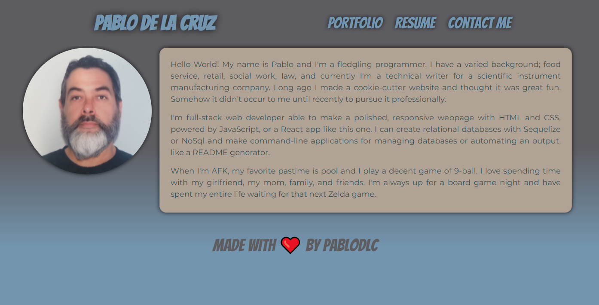

# **pablodlc: Portfolio**

Please visit my deployed portfolio by clicking the following link: [pablodlc@github.io](http://pablodlc.github.io).  
To see the progress I made during my boot camp, please click the following link to visit the profile I made just 15 weeks before this one: [pablodlc.github.io/portfolio-old](https://pablodlc.github.io/portfolio-old/)

-   [Description](#description)
-   [Future Developments](#future%20developments)
-   [Questions?](#questions)

## Description
 

## Future Developments

My ideas for future developments on **budget-tracker** would be to add security to keep users' financial interests private by means of a login and password. I would then have the option to create budgets so that users could track multiple budgets with one account. Eventually linking budgets to one master table would be a great feature. This would let users manage sub-budgets connected to a master budget. However, the most lacking feature is a way to clear the database from the application.

---

## Questions?

Please feel free to contact me with any questions or comments, or visit my GitHub to see more of my work.  
[Contact me by email](mailto:pablodlc@gmail.com)  
[GitHub User pablodlc](https://github.com/pablodlc)  
[**pablodlc.github.com** GitHub Repo](https://pablodlc.github.io)

**pablodlc.github.io** made with ❤️ by pablodlc
