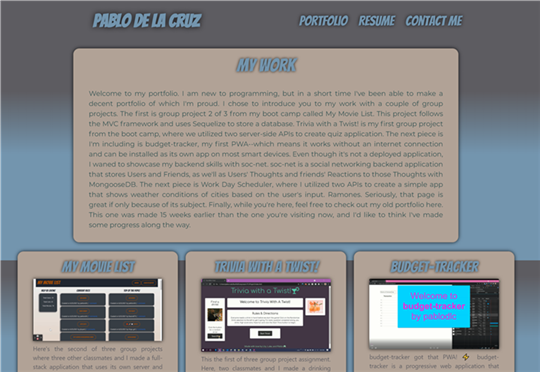
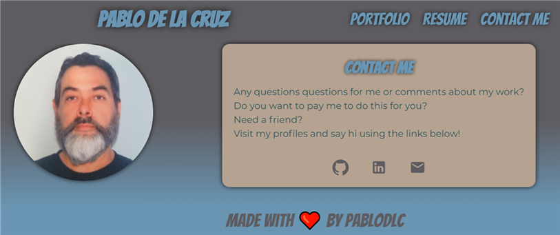
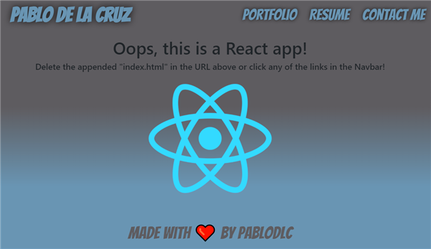

# **pablodlc: Portfolio**

Please visit my deployed portfolio by clicking the following link: [pablodlc@github.io](http://pablodlc.github.io).  
To see the progress I made during my boot camp, please click the following link to visit the profile I made just 15 weeks before this one: [pablodlc.github.io/portfolio-old](https://pablodlc.github.io/portfolio-old/)  
Still not enough? a video demo of my portfolio can be seen on my YouTube page by clicking [here](https://www.youtube.com/watch?v=UL7lCgkr74o).

### Table of Contents

-   [Description](#description)
-   [Future Developments](#future%20developments)
-   [Questions?](#questions)

## Description

This is my portfolio, a React app with two page elements and four pages:

-   **Page Elements**  
    There are two page elements that appear on every page: the `Navbar` and the `Footer`. - `Navbar`: a responsive Navbar with my name, which works as a link to the home page. There are also links to the corresponding `li`s `Portfolio`, `Resume`, and `Contact Me`. Each of the links have a fun hover effect that change the font to _Creepster_. - `Footer`: My `Footer` is lovingly borrowed from _Horiseon_, the first assignment in my coding boot camp.
-   **Pages**
    -   `Home`: `Home` is the homepage of my portfolio page with an image of yours truly and a brief bio.  
        
    -   `Portfolio`: I use this page to showcase my work. I have a card welcoming the user to my portfolio followed by six featured projects; each of which are in a formatted React-Bootstrap Card. Within the `Card`, there is a `Card.Title` which contains the project name and doubles as a link to the deployed application. Next is an image of the application. Below that, is a brief description of the project.
        
    -   `Resume`: Below the _My Resume_ headline, is another header that is a link to download a .pdf copy of my resume. Below that link is a Bootstrap Card I formatted as a resume.
        
    -   `Contact Me`: My `Contact Me` page resourcefully reuses the format from Home. After some brief text are three links: two that open my [GitHub](https://github.com/pablodlc) and [LinkedIn](https://www.linkedin.com/in/pablodlc) profiles respectively, and the third is a [`mailto`](mailto:pablodlc@gmail.com) link that sends to my email address.
        
    -   `index.html`: I included a little error handling by adding an `index.html` component when a user navigates to pablodlc.github.io/index.html.
        

## Future Developments

1. **Styling/Responsiveness**: My next revisitation will have me improve the responsiveness of the page, including breakpoints and media queries. Another feature I'd like to add is a hover effect on my mug shot on the Home and Contact pages, where mousing over the picture reveals a pic of me looking extremely unkempt.

2. **PWA**: Although there is no need for this application to be a Progressive Web Application, I would like to refactor it to be one in order to demonstrate my ability to do so.

---

## Questions?

Please feel free to contact me with any questions or comments, or visit my GitHub to see more of my work.  
[Contact me by email](mailto:pablodlc@gmail.com)  
[GitHub User pablodlc](https://github.com/pablodlc)  
[**pablodlc.github.com** GitHub Repo](https://pablodlc.github.io)

**pablodlc.github.io** made with ❤️ by pablodlc
